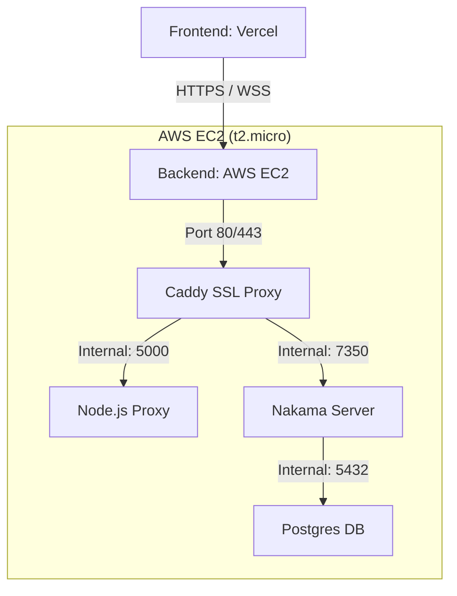

# 🚀 $0 Multiplayer Deployment Guide

This guide will walk you through deploying your server-authoritative Tic-Tac-Toe game to **AWS** and **Vercel** for exactly **$0/month** using the AWS Free Tier.

---

## 🏗️ Architecture Overview



---

##  Schritt 1: AWS EC2 Setup ($0)

1.  **Launch Instance**: Go to AWS Console ➡ EC2 ➡ Launch Instance.
    -   **Name**: `tic-tac-toe-backend`
    -   **OS**: **Amazon Linux 2023** (Free Tier eligible).
    -   **Instance Type**: `t2.micro` (or `t3.micro` if available in your region).
    -   **Key Pair**: Create a new one and save the `.pem` file.
2.  **Security Group** (Firewall):
    -   Add **Inbound Rule**: Type `HTTP`, Port `80`, Source `0.0.0.0/0`.
    -   Add **Inbound Rule**: Type `HTTPS`, Port `443`, Source `0.0.0.0/0`.
    -   Add **Inbound Rule**: Type `SSH`, Port `22`, Source `My IP`.

---

## Schritt 2: Domain Setup (DuckDNS)

1.  Go to [duckdns.org](https://www.duckdns.org/).
2.  Log in and create a subdomain: `tic-tac-toe` (or something unique).
3.  In the **IP** field, paste your **EC2 Public IPv4 address**.
4.  Click **Update IP**.

---

## Schritt 3: Server Installation

Connect to your EC2 instance via SSH:
```bash
ssh -i your-key.pem ec2-user@your-ec2-ip
```

Run these commands to install Docker:
```bash
sudo dnf update -y
sudo dnf install -y docker
sudo systemctl start docker
sudo systemctl enable docker
sudo usermod -aG docker ec2-user
# Log out and log back in for permissions to take effect
exit
```

Log back in and install Docker Compose:
```bash
sudo curl -L "https://github.com/docker/compose/releases/latest/download/docker-compose-$(uname -s)-$(uname -m)" -o /usr/local/bin/docker-compose
sudo chmod +x /usr/local/bin/docker-compose
```

---

## Schritt 4: Moving your Code to AWS

You have two choices for getting your code from your computer onto the AWS instance.

### Choice A: Secure Copy (SCP) - *Fastest for a one-time test*
Open a terminal **on your local machine** (the one you are using right now) and run:
```bash
# Replace 'your-key.pem' and 'your-ec2-ip' with your actual details
scp -i your-key.pem -r ./tic-tac-toe-api ec2-user@your-ec2-ip:~/
```

### Choice B: Git - *Best for regular updates*
1.  **On the AWS Server**, install git:
    ```bash
    sudo dnf install git -y
    ```
2.  **Clone your repository**:
    ```bash
    git clone https://github.com/your-username/tic-tac-toe-api.git
    cd tic-tac-toe-api
    ```

---

## Schritt 5: Configuration & Launch

Now that your code is on the server, follow these steps:

1.  **Navigate into the folder**: `cd ~/tic-tac-toe-api`
2.  **Create the Production .env**:
    ```bash
    nano .env
    ```
    *Paste these values and update them:*
    ```env
    FRONTEND_URL=https://your-app.vercel.app
    POSTGRES_DB=nakama
    POSTGRES_PASSWORD=your_secure_password
    NAKAMA_SERVER_KEY=your_secure_key
    NAKAMA_PORT=7350
    ```
    *(Press `Ctrl+O`, `Enter`, then `Ctrl+X` to save and exit)*

3.  **Start Services**:
    ```bash
    # This will now build both the Node proxy and the Nakama modules automatically
    docker-compose up -d --build
    ```

---

## Schritt 6: Frontend Configuration (Vercel)

1.  Connect your GitHub repo to **Vercel**.
2.  Add **Environment Variables** in the Vercel Dashboard:
    -   `NEXT_PUBLIC_API_BASE_URL`: `https://tic-tac-toe.duckdns.org/auth`
    -   `NEXT_PUBLIC_NAKAMA_HOST`: `tic-tac-toe.duckdns.org`
    -   `NEXT_PUBLIC_NAKAMA_PORT`: `443`
    -   `NEXT_PUBLIC_NAKAMA_USE_SSL`: `true`
3.  **Deploy**.

---

## 🛠️ Troubleshooting

### SSL Not Working
- Check if port 80 is open in AWS. Caddy needs port 80 to verify your domain with Let's Encrypt.
- Run `docker logs caddy` to see the SSL challenge status.

### WebSocket Connection Failures
- Ensure `NEXT_PUBLIC_NAKAMA_USE_SSL` is `true`.
- Ensure you are connecting to port `443` (Caddy handles the internal redirect to 7350).

---

## 💰 Bonus: $0 Cost Management

-   **Stop Instance**: If you aren't using the game, stop the EC2 instance in the AWS Console to save your 750 free hours/month.
-   **Instance Type**: Ensure you always use `t2.micro` or `t3.micro`. Other types will cost money!

---

## 🎨 Clean Architecture Diagram

The system uses **Caddy** as a "Shield." It receives all incoming traffic on port 443, handles the heavy encryption work, and then passes the "clean" messages to your Node Proxy or Nakama server through the high-speed internal Docker network. Note that the **Postgres Database** is hidden behind the firewall and cannot be accessed from the internet, keeping your data safe!
